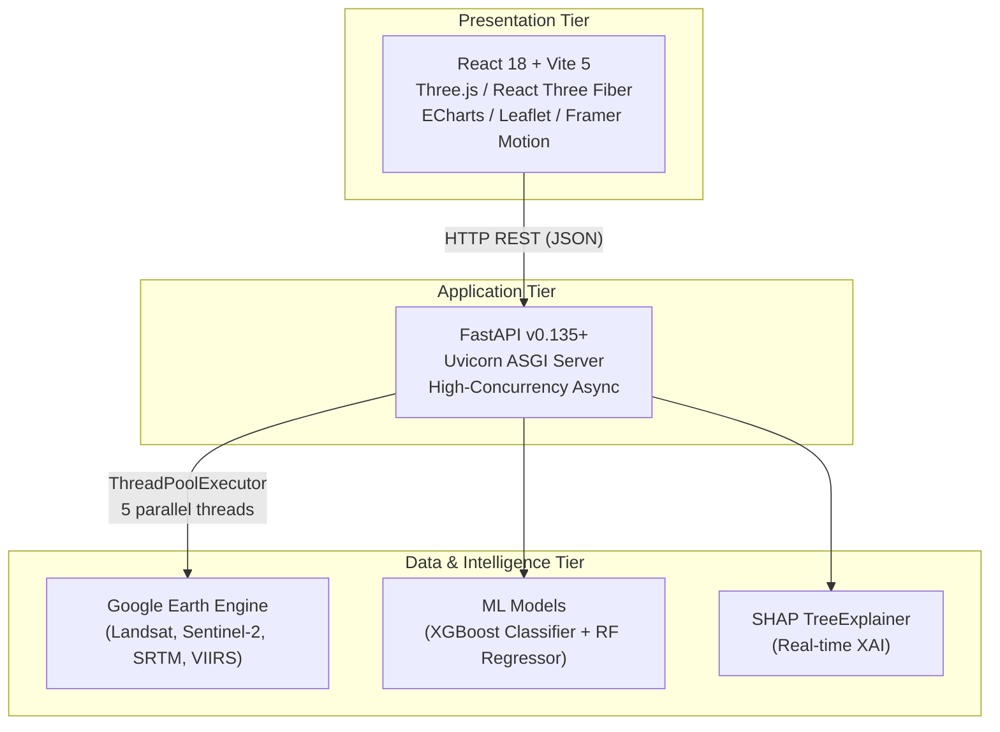
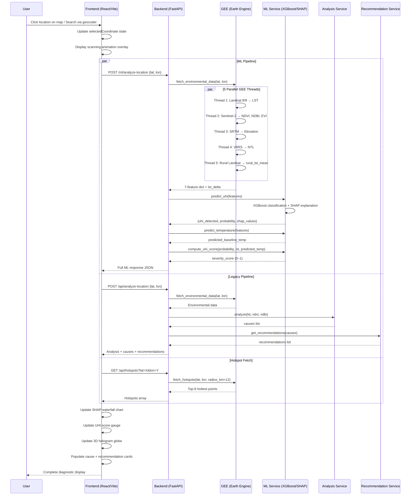
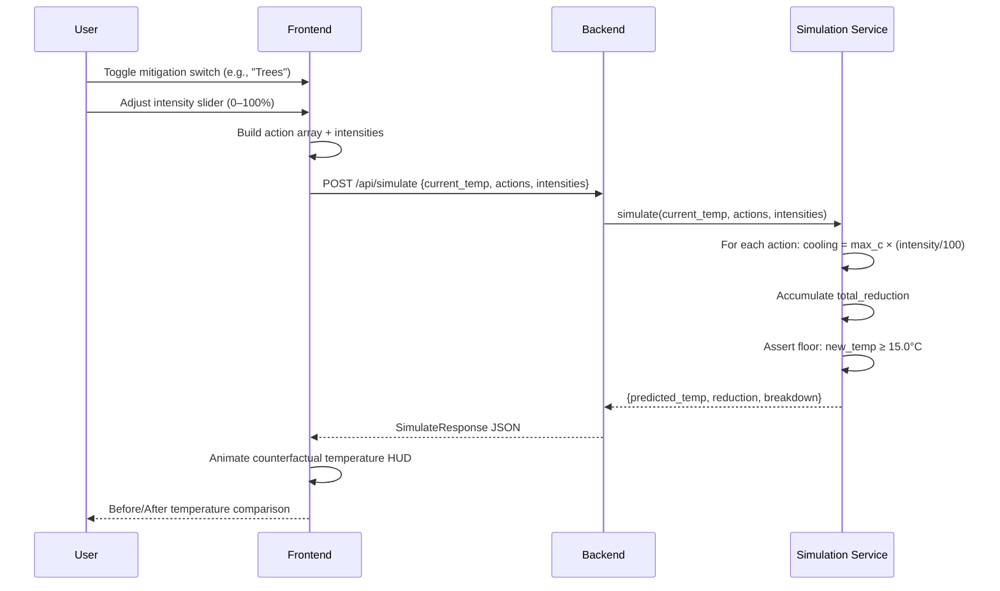
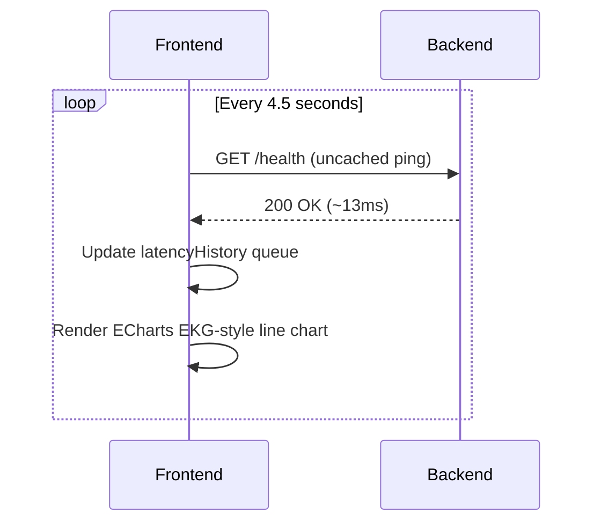
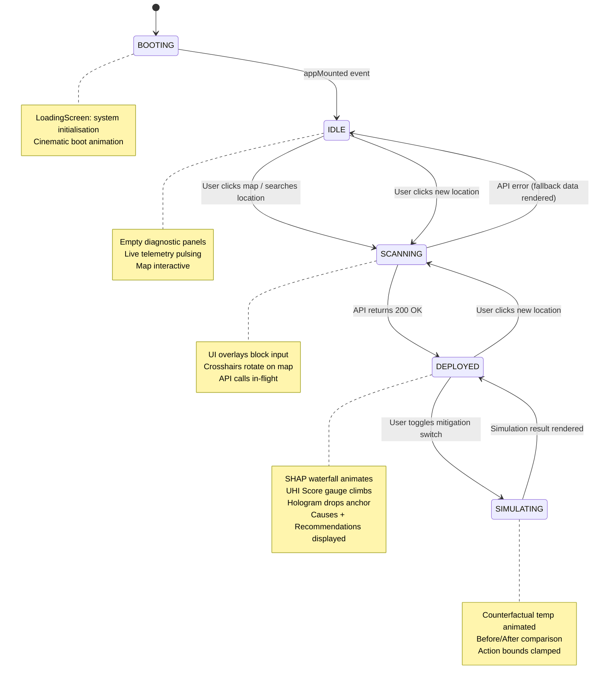

# Urban Heat Intelligence System (UHIS): Real-Time Detection, Explainable Classification, and Counterfactual Mitigation Simulation of Urban Heat Islands Using Multi-Satellite Geospatial Data and XGBoost-SHAP Ensemble

> **Conference-Ready Technical Reference Document**
> Author: Shivam Mittal | Date: April 2026

---

## Table of Contents

1. [Abstract](#1-abstract)
2. [Introduction & Problem Statement](#2-introduction--problem-statement)
3. [Related Work & Literature Context](#3-related-work--literature-context)
4. [System Architecture](#4-system-architecture)
5. [Multi-Modal Satellite Dataset](#5-multi-modal-satellite-dataset)
6. [Feature Engineering](#6-feature-engineering)
7. [Machine Learning Pipeline](#7-machine-learning-pipeline)
8. [Explainable AI (XAI) Engine](#8-explainable-ai-xai-engine)
9. [Mitigation Simulation Engine](#9-mitigation-simulation-engine)
10. [Technology Stack](#10-technology-stack)
11. [API Design & Endpoints](#11-api-design--endpoints)
12. [Frontend Architecture & Visualization](#12-frontend-architecture--visualization)
13. [End-to-End Workflow](#13-end-to-end-workflow)
14. [Dataflow Architecture (DFD)](#14-dataflow-architecture-dfd)
15. [State Machine Model](#15-state-machine-model)
16. [Results & Evaluation](#16-results--evaluation)
17. [Comparative Analysis (v1 → v2)](#17-comparative-analysis-v1--v2)
18. [Conclusions & Future Work](#18-conclusions--future-work)
19. [References](#19-references)

---

## 1. Abstract

Urban Heat Islands (UHIs) represent one of the most pressing environmental challenges of the 21st century, where urbanised areas exhibit significantly elevated temperatures compared to surrounding rural regions. This paper presents the **Urban Heat Intelligence System (UHIS)** — a production-grade, web-based geospatial intelligence platform that integrates **real-time multi-satellite remote sensing data** from Google Earth Engine with an **Explainable AI (XAI) pipeline** built on XGBoost and SHAP (SHapley Additive exPlanations) to detect, classify, and simulate mitigation strategies for UHI effects at any coordinate on Earth.

The system synthesises **7 spectral, topographic, and anthropogenic features** extracted concurrently from **4 satellite constellations** (Landsat 8/9, Sentinel-2, NASA SRTM, NOAA VIIRS) across a **4,882-sample global dataset spanning 62 cities and 6 climate zones**. The XGBoost classifier achieves **93.49% accuracy** and **0.985 ROC-AUC** under strict spatial cross-validation (GroupKFold by city), while the Random Forest regressor explains **94.16% of temperature variance** (R² = 0.9416, RMSE = ±2.08°C). An integrated counterfactual simulation engine enables real-time "what-if" analysis of urban planning interventions grounded in peer-reviewed literature bounds.

The frontend delivers an award-tier mission-control interface featuring **3D WebGL data holograms** (Three.js/React Three Fiber), **real-time SHAP waterfall visualisations** (Apache ECharts), **interactive Leaflet geospatial maps** with live GEE tile overlays, and **Framer Motion cinematic animations** — all orchestrated by a high-concurrency FastAPI backend.

**Keywords:** Urban Heat Island, Remote Sensing, XGBoost, SHAP, Explainable AI, Google Earth Engine, Land Surface Temperature, NDVI, Geospatial Intelligence, Climate Simulation

---

## 2. Introduction & Problem Statement

### 2.1 Background

The Urban Heat Island (UHI) phenomenon occurs when metropolitan areas experience significantly higher temperatures than their surrounding rural counterparts. This temperature differential arises from the modification of land surfaces during urbanisation — replacing natural vegetation and permeable soils with impervious materials such as concrete, asphalt, and metal roofing that absorb and re-radiate solar energy. The UHI effect is not merely a thermal curiosity; it has direct consequences for **public health** (heat-related mortality), **energy consumption** (increased cooling loads), **air quality** (accelerated ground-level ozone formation), and **water systems** (thermal pollution of urban runoff).

### 2.2 Problem Statement

Despite the growing availability of satellite remote sensing data, existing UHI detection approaches suffer from several critical limitations:

1. **Physics-Blind Thresholds:** Most systems use a fixed absolute temperature threshold (e.g., LST > 35°C) to flag UHI, failing to differentiate between a city in the Sahara (where 45°C is ambient) and a temperate European city where 35°C is anomalous.
2. **Insufficient Feature Space:** Many approaches rely on only 2–3 spectral indices (LST, NDVI), missing anthropogenic drivers like nighttime energy emissions and topographic cooling gradients.
3. **Validation Leakage:** Random train/test splits allow data from the same city to appear in both sets, artificially inflating reported accuracy via spatial autocorrelation.
4. **Black-Box Classification:** Models provide a binary "UHI / not-UHI" label without explaining *which* environmental factors pushed the classification — a critical gap for urban planners who need to know *why* and *what to do about it*.
5. **No Actionable Feedback Loop:** Existing tools stop at detection; they do not provide counterfactual simulation (e.g., "what happens to temperature if we plant 40% more trees?").

### 2.3 Proposed Solution

The UHIS addresses all five gaps through:

- **`lst_delta`-based labelling** — a climate-zone-adaptive relative thermal anomaly metric that isolates true urban heat from geographic baselines
- **7-dimensional feature vectors** spanning spectral, topographic, and anthropogenic domains
- **Spatial GroupKFold cross-validation** preventing geographic leakage
- **Real-time SHAP explanations** decomposing every prediction into per-feature contributions
- **Literature-grounded counterfactual simulation** allowing interactive what-if analysis

---

## 3. Related Work & Literature Context

### 3.1 Remote Sensing for UHI Detection

| Study | Dataset | Method | Limitation Addressed by UHIS |
|-------|---------|--------|------------------------------|
| Voogt & Oke (2003) | Landsat TM | Thermal mapping | Static; no ML classification |
| Zhou et al. (2019) | MODIS LST | Random Forest | Only 3 features; no XAI |
| Deilami et al. (2018) | Multi-source | Literature review | No operational system |
| Santamouris (2014) | Field measurements | Empirical cooling curves | Used for our simulation bounds |
| Bowler et al. (2010) | Meta-analysis | Green infrastructure review | Used for tree cover cooling bounds |
| Taha (1997) | Measurements | Albedo/water body analysis | Used for water feature bounds |

### 3.2 Explainable AI in Geospatial ML

SHAP (Lundberg & Lee, 2017) provides theoretically grounded feature attributions via game-theoretic Shapley values. This system applies `shap.TreeExplainer` — an exact polynomial-time algorithm for tree ensembles — directly on the XGBoost classifier during inference, producing local explanations for each individual prediction rather than relying on global Gini importance alone.

### 3.3 Key Contribution of This Work

This system is unique in combining **(a)** real-time satellite data extraction, **(b)** production ML classification with XAI, and **(c)** interactive counterfactual simulation into a single deployed platform with an Awwwards-tier visual interface. No prior system in the literature delivers all three as an integrated, publicly accessible web application.

---

## 4. System Architecture

### 4.1 Three-Tier Architecture Overview



### 4.2 Backend Microservice Decomposition

The backend (`FastAPI v2.0.0`) is decomposed into **6 distinct service modules**, each with a single responsibility:

| Service Module | File | Responsibility |
|---|---|---|
| **GEE Service** | `gee_service.py` (569 lines) | Authenticates with GEE, fetches all 7 features via 5 parallel threads, computes `lst_delta` |
| **ML Service** | `ml_service.py` (437 lines) | Loads serialised models, builds feature vectors, runs XGBoost/RF inference, computes SHAP |
| **Analysis Service** | `analysis_service.py` (159 lines) | Classifies LST/NDVI/NDBI into human-readable levels, detects UHI, identifies environmental causes |
| **Recommendation Service** | `recommendation_service.py` (135 lines) | Maps detected causes to actionable mitigation strategies with impact estimates |
| **Simulation Service** | `simulation_service.py` (89 lines) | Calculates projected temperature after applying mitigation actions with intensity scaling |
| **Thresholds Config** | `thresholds.py` (60 lines) | Centralised configuration for all classification thresholds, satellite parameters, and simulation bounds |

### 4.3 Data Model Architecture

All request/response payloads are validated through **Pydantic v2 schemas** (`schemas.py`, 162 lines) providing type-safe serialisation, automatic API documentation, and runtime validation. Key schemas include:

- `MLAnalyzeRequest` / `MLAnalyzeResponse` — Full ML analysis pipeline I/O
- `MLSimulateRequest` / `MLSimulateResponse` — Mitigation simulation I/O
- `MLEnvironmentalData` — 7-feature environmental vector with data provenance
- `CauseItem` / `RecommendationItem` — Structured diagnostic outputs

---

## 5. Multi-Modal Satellite Dataset

### 5.1 Data Sources

The system extracts data from **4 satellite constellations** via Google Earth Engine's cloud compute infrastructure:

| # | Satellite / Sensor | Provider | Data Product | Feature Extracted | Resolution | Band(s) Used |
|---|---|---|---|---|---|---|
| 1 | **Landsat 8 / 9** | USGS | `LANDSAT/LC08/C02/T1_L2` `LANDSAT/LC09/C02/T1_L2` | Land Surface Temperature (LST) in °C | 30 m (thermal) | ST_B10 |
| 2 | **Sentinel-2** | ESA Copernicus | `COPERNICUS/S2_SR_HARMONIZED` | NDVI, NDBI, EVI | 10 m (spectral) | B2, B4, B8, B11 |
| 3 | **NASA SRTM** | NASA/USGS | `USGS/SRTMGL1_003` | Elevation (metres) | 30 m | elevation |
| 4 | **NOAA VIIRS** | NOAA | `NOAA/VIIRS/DNB/MONTHLY_V1/VCMSLCFG` | Nighttime Light Radiance (nW/cm²/sr) | 500 m | avg_rad |

### 5.2 LST Computation

Land Surface Temperature is derived from Landsat 8/9 Collection 2 Level-2 surface temperature product:

```
LST_Kelvin = ST_B10 × 0.00341802 + 149.0
LST_Celsius = LST_Kelvin − 273.15
```

The system first queries Landsat 8; if no imagery is available for the ROI (Region of Interest), it transparently falls back to Landsat 9.

### 5.3 Spectral Index Computation

| Index | Formula | Bands | Purpose |
|-------|---------|-------|---------|
| **NDVI** | (NIR − Red) / (NIR + Red) | B8, B4 | Vegetation density indicator |
| **NDBI** | (SWIR − NIR) / (SWIR + NIR) | B11, B8 | Built-up/impervious surface density |
| **EVI** | 2.5 × (NIR − Red) / (NIR + 6×Red − 7.5×Blue + 1) | B8, B4, B2 | Enhanced vegetation — robust in high-biomass / dense canopy areas |

> **Note on EVI:** Sentinel-2 Surface Reflectance bands are stored as integers scaled ×10,000. The system normalises by dividing by 10,000 before applying the EVI formula. EVI values are clipped to the plausible range [-1, 2].

### 5.4 Rural Baseline Temperature

A critical innovation is the **annular rural buffer** computation:

- **Inner radius:** 3 km (urban core exclusion zone for inference; 8 km for training)
- **Outer radius:** 15 km (rural sampling ring)
- The urban point is buffered to create an annulus: `rural_ring = point.buffer(outer_km).difference(point.buffer(inner_km))`
- `rural_lst_mean` = mean LST within this annulus
- `lst_delta = lst_celsius − rural_lst_mean`

This ensures that `lst_delta` captures the *true thermal anomaly* caused by urbanisation, not geographic climate baselines.

### 5.5 Dataset Construction

**Script:** `collect_dataset.py` (439 lines)

| Parameter | Value |
|---|---|
| Total cities | **62** (covering all inhabited continents) |
| Climate zones covered | **6** (Arid, Tropical, Subtropical, Temperate, Mediterranean, Monsoon) |
| Samples per city | **80** (via `ee.Image.sample()` with `numPixels=80`) |
| Total samples | **4,882** |
| Temporal window | March – July (peak heating), 2021–2024 |
| Cloud cover filter | ≤ 20% |
| UHI positive rate | **44.94%** (well-balanced binary classification) |

### 5.6 Climate-Zone-Adaptive UHI Labelling

Rather than a fixed global threshold, the system uses **climate-zone-specific `lst_delta` thresholds** to label UHI:

| Climate Zone | Threshold (°C) | Rationale |
|---|---|---|
| Arid | 3.5 | Desert cities have extreme ambient heat — higher bar needed |
| Tropical | 2.5 | High baseline humidity moderates relative anomaly |
| Subtropical | 2.0 | Standard mid-latitude threshold |
| Temperate | 1.5 | Even 1.5°C above rural is a meaningful signal |
| Mediterranean | 2.0 | Dry summer / wet winter cycle |
| Monsoon | 2.5 | Seasonal precipitation effects |

```
uhi_label = 1  if  lst_delta ≥ zone_threshold  else  0
```

### 5.7 Global City Registry

The 62 cities span the following regions:

| Region | Cities | Count |
|---|---|---|
| Africa | Cairo, Lagos, Nairobi, Johannesburg, Dakar, Casablanca, Addis Ababa, Khartoum, Accra, Kinshasa | 10 |
| South Asia | Delhi, Mumbai, Kolkata, Dhaka, Karachi, Lahore, Chennai, Hyderabad | 8 |
| East / SE Asia | Beijing, Shanghai, Chengdu, Wuhan, Tokyo, Seoul, Taipei, Bangkok, Singapore, Jakarta, Manila, Ho Chi Minh | 12 |
| Middle East / Central Asia | Tehran, Riyadh, Dubai, Kuwait City, Doha, Baghdad, Istanbul, Ankara | 8 |
| Europe | London, Paris, Berlin, Madrid, Rome, Athens, Warsaw, Moscow, Barcelona | 9 |
| North America | New York, Los Angeles, Chicago, Phoenix, Houston, Miami, Las Vegas, Toronto, Mexico City | 9 |
| South America | São Paulo, Buenos Aires, Lima, Bogotá | 4 |
| Oceania | Sydney, Melbourne | 2 |

### 5.8 Dataset Schema (CSV Columns)

```
lat, lon, lst, ndvi, ndbi, evi, elevation, ntl, lst_delta,
city, country, climate_zone, zone_type, rural_lst_mean, uhi_label
```

---

## 6. Feature Engineering

### 6.1 Classifier Feature Vector (6 features)

| # | Feature | Source | Meaning | Why Included |
|---|---|---|---|---|
| 1 | `lst_delta` | Derived (Landsat) | Urban LST − Rural LST mean (°C) | Isolates true thermal anomaly from geographic baselines; prevents label leakage from raw LST |
| 2 | `ndvi` | Sentinel-2 | Vegetation density (-1 to 1) | Inverse proxy for impervious surface; cooling capacity indicator |
| 3 | `ndbi` | Sentinel-2 | Built-up density (-1 to 1) | Direct proxy for urban thermal mass |
| 4 | `evi` | Sentinel-2 | Enhanced vegetation (-1 to 2) | More robust than NDVI in dense canopy / high-biomass areas |
| 5 | `elevation` | NASA SRTM | Altitude (metres) | Topographic cooling gradients; temperature decreases ~6.5°C per 1000m |
| 6 | `ntl` | VIIRS | Nighttime light radiance (nW/cm²/sr) | Proxy for anthropogenic heat emission; captures waste heat from energy use |

> **Critical Design Decision:** Raw `lst` (absolute temperature) is **excluded** from the classifier features to prevent label leakage. Since `uhi_label` is derived from `lst - rural_lst_mean`, including raw `lst` would create a circular dependency. Instead, `lst_delta` (the relative anomaly) is used — this is the actual signal the classifier needs to learn.

### 6.2 Regressor Feature Vector (7 features)

| # | Feature | Purpose |
|---|---|---|
| 1 | `ndvi` | Vegetation cooling effect |
| 2 | `ndbi` | Built-up thermal mass load |
| 3 | `evi` | Dense canopy vegetation signal |
| 4 | `elevation` | Altitudinal temperature lapse rate |
| 5 | `ntl` | Anthropogenic heat contribution |
| 6 | `abs_lat` | Absolute latitude — proxy for solar irradiance |
| 7 | `rural_lst_mean` | Regional climate baseline anchor |

The regressor predicts **absolute LST** from the feature vector, enabling counterfactual simulation by adjusting spectral indices.

### 6.3 Feature Preprocessing

- **StandardScaler**: Applied only to classifier inputs (XGBoost benefits from normalised features during hyperparameter search)
- **EVI clipping**: Values clamped to [-1, 2] to handle edge-pixel artefacts
- **LST sanity check**: Samples with LST outside [-10, 80]°C are dropped
- **NDVI/NDBI range check**: Values outside [-1, 1] are dropped
- **Missing auxiliary features**: If EVI, elevation, or NTL are unavailable for a sample, sensible defaults are applied (EVI ≈ NDVI×0.9, elevation = 0, NTL = 0)

---

## 7. Machine Learning Pipeline

### 7.1 Classifier: XGBoost with Hyperparameter Optimisation

**Script:** `train_model.py` (430 lines)

| Component | Detail |
|---|---|
| **Algorithm** | `XGBClassifier` (XGBoost v3.2.0) |
| **Objective** | Binary classification (UHI / not-UHI) |
| **Evaluation metric** | Log-loss |
| **Hyperparameter search** | `RandomizedSearchCV` (n_iter=30, cv=5, scoring='f1') |

**Search Space:**

| Hyperparameter | Values Explored |
|---|---|
| `n_estimators` | [100, 200, 300, 500] |
| `max_depth` | [3, 5, 7, 9] |
| `learning_rate` | [0.01, 0.05, 0.10, 0.20] |
| `subsample` | [0.7, 0.8, 0.9, 1.0] |
| `colsample_bytree` | [0.6, 0.7, 0.8, 1.0] |
| `min_child_weight` | [1, 3, 5] |
| `gamma` | [0, 0.1, 0.2] |
| `scale_pos_weight` | [1, class_ratio] |

### 7.2 Spatial Cross-Validation: GroupKFold

To prevent **spatial autocorrelation leakage** (where data from the same city appears in both train and test sets), the system implements `GroupKFold` with the **city name** as the grouping variable:

```python
groups = df["city"].values
gkf = GroupKFold(n_splits=min(5, df["city"].nunique()))
train_idx, test_idx = list(gkf.split(X_scaled, y, groups=groups))[-1]
```

This ensures that **entire cities** are held out for testing — the model must generalise to cities it has never seen during training. This is a significantly harder validation regime than random splitting and produces more honest accuracy estimates.

### 7.3 Regressor: Random Forest

| Component | Detail |
|---|---|
| **Algorithm** | `RandomForestRegressor` (scikit-learn v1.8.0) |
| **n_estimators** | 300 |
| **max_depth** | None (unlimited) |
| **min_samples_leaf** | 2 |
| **Target variable** | LST in °C |
| **Train/test split** | 80/20 random split (stratification not applicable to regression) |

### 7.4 Model Serialisation

All trained artefacts are persisted via `joblib`:

| Artefact | File | Size | Format |
|---|---|---|---|
| XGBoost Classifier | `uhi_classifier.pkl` | ~178 KB | Pickled XGBClassifier |
| RF Regressor | `temp_regressor.pkl` | ~44 MB | Pickled RandomForestRegressor (300 trees) |
| StandardScaler | `scaler.pkl` | ~0.7 KB | Pickled StandardScaler |
| Feature Importance Report | `feature_importance.json` | ~1.1 KB | JSON metadata |

### 7.5 Feature-Count-Aware Inference

The inference service (`ml_service.py`) dynamically detects whether the loaded model is v1 (3 features) or v2 (6 features) by probing `model.n_features_in_` at startup. This enables **backward compatibility** — a v1 model will still work with the v2 backend.

```python
_clf_n_features = int(_clf.n_features_in_)  # 3 (v1) or 6 (v2)
```

---

## 8. Explainable AI (XAI) Engine

### 8.1 SHAP Integration

The system uses **SHAP** (SHapley Additive exPlanations, v0.45.0), specifically the `TreeExplainer` algorithm which provides **exact** (not approximate) Shapley values for tree ensemble models in polynomial time.

**How it works during inference:**

```python
explainer = shap.TreeExplainer(xgboost_classifier)
shap_values = explainer.shap_values(X_scaled)
base_value = explainer.expected_value  # log-odds base rate
```

### 8.2 SHAP Output Structure

For each prediction, the system computes and returns:

| Output | Description |
|---|---|
| `shap_base_value` | The model's expected log-odds prediction before seeing any features (the "baseline") |
| `shap_values` | A dictionary mapping each feature name to its log-odds contribution |

**Example response payload:**
```json
{
  "shap_values": {
    "lst_delta": 2.4102,
    "ndbi": 1.1340,
    "ndvi": -0.3201,
    "evi": -0.1520,
    "elevation": -0.0890,
    "ntl": 0.2100
  },
  "shap_base_value": -0.5023
}
```

**Interpretation:** `lst_delta = +2.41` means the urban-rural temperature difference pushed the log-odds 2.41 units toward "UHI = 1". Negative values (e.g., NDVI = -0.32) push toward "UHI = 0" (i.e., vegetation is providing cooling).

### 8.3 Frontend SHAP Visualisation

The SHAP values are rendered as an **ECharts waterfall bar chart** in the frontend's diagnostic panel, showing:
- Each feature as a horizontal bar
- Positive contributions (pushing toward UHI) in red
- Negative contributions (pushing away from UHI) in blue/green
- The base value as the starting anchor

This provides urban planners with an **immediately interpretable** decomposition of *why* the model flagged a location as a UHI hotspot.

### 8.4 Advantages Over Global Importance

| Approach | Scope | Limitation |
|---|---|---|
| Gini Importance (v1) | Global average across all predictions | Cannot explain individual cases |
| SHAP TreeExplainer (v2) | **Local** — unique per prediction | Computationally exact; reveals feature interactions |

---

## 9. Mitigation Simulation Engine

### 9.1 Overview

The simulation engine enables **counterfactual analysis** — "What would the temperature be if specific urban planning interventions were implemented?" The engine is grounded in **peer-reviewed empirical literature**.

### 9.2 Supported Mitigation Actions

| Action Key | Label | Max Cooling (°C) | NDVI Delta | NDBI Delta | Literature Source |
|---|---|---|---|---|---|
| `trees` | Urban Tree Cover | 4.0 | +0.18 | -0.05 | Bowler et al. (2010) |
| `cool_roof` | Cool/Reflective Roofing | 5.5 | 0.00 | -0.15 | Santamouris (2014) |
| `water` | Water Features | 2.5 | +0.10 | -0.06 | Taha (1997) |
| `green_roof` | Green Roofs & Vertical Gardens | 2.5 | +0.08 | -0.10 | Santamouris (2014) |

### 9.3 Simulation Algorithm

```
For each action in selected_actions:
    intensity = slider_value / 100  (0.0 to 1.0)
    cooling = max_cooling × intensity
    total_reduction += cooling
    ndvi_modified += ndvi_delta
    ndbi_modified += ndbi_delta

new_temperature = max(original_lst - total_reduction, 15.0°C)
```

**Absolute floor:** The simulated temperature cannot drop below **15.0°C** — a physics sanity bound ensuring the simulation doesn't produce unrealistic sub-ambient results.

### 9.4 Dual Simulation Modes

The system supports **two simulation modes**:

1. **Literature-Based (Primary — `simulation_service.py`):** Applies empirical cooling bounds directly. Faster, deterministic, and bounded by published research.
2. **ML-Recalculation (Secondary — `ml_service.simulate_mitigation()`):** Adjusts the feature vector (NDVI, NDBI) and re-runs the Random Forest regressor. Useful for exploring non-linear interactions, but subject to model extrapolation risk.

---

## 10. Technology Stack

### 10.1 Backend Stack

| Technology | Version | Purpose |
|---|---|---|
| **Python** | 3.11+ | Core language |
| **FastAPI** | ≥ 0.135.2 | High-performance async REST API framework |
| **Uvicorn** | ≥ 0.30.0 | ASGI server for FastAPI |
| **earthengine-api** | ≥ 1.7.19 | Google Earth Engine Python SDK |
| **XGBoost** | ≥ 3.2.0 | Gradient boosting classifier |
| **scikit-learn** | ≥ 1.8.0 | Random Forest regressor, preprocessing, CV |
| **SHAP** | ≥ 0.45.0 | Explainable AI — TreeExplainer |
| **Pandas** | ≥ 2.0.0 | Data manipulation |
| **NumPy** | ≥ 1.24.0 | Numerical computation |
| **SciPy** | ≥ 1.10.0 | Statistical functions |
| **Joblib** | ≥ 1.3.0 | Model serialisation |
| **Pydantic** | ≥ 2.0.0 | Request/response validation |

### 10.2 Frontend Stack

| Technology | Version | Purpose |
|---|---|---|
| **React** | 18.3.1 | UI component framework |
| **Vite** | 5.4.11 | Build tool / dev server |
| **Three.js** | 0.183.2 | WebGL 3D rendering |
| **React Three Fiber** | 8.16.1 | React renderer for Three.js |
| **@react-three/drei** | 9.105.6 | Three.js helpers/primitives |
| **Apache ECharts** | 6.0.0 | High-performance data visualisation (SHAP waterfall, telemetry) |
| **Leaflet** | 1.9.4 | Interactive geospatial map |
| **Framer Motion** | 11.0.0 | Physics-based animations |
| **GSAP** | 3.14.2 | Advanced timeline animations |
| **Lucide React** | 1.7.0 | Icon library |
| **react-globe.gl** | 2.37.0 | 3D holographic globe |
| **html2canvas + jsPDF** | Latest | PDF report generation |
| **TailwindCSS** | 3.4.17 | Utility-first CSS (with custom design system) |

### 10.3 External Services

| Service | Purpose | Authentication |
|---|---|---|
| **Google Earth Engine** | Satellite data computation | Service account JSON key (OAuth2) |
| **OpenStreetMap Nominatim** | Geocoding (address → coordinates) | Public API (rate-limited) |
| **Vercel** | Frontend deployment | CI/CD pipeline |

---

## 11. API Design & Endpoints

### 11.1 RESTful API Routes

| Method | Endpoint | Purpose | Input | Output |
|---|---|---|---|---|
| `POST` | `/ml/analyze-location` | **Primary:** Full ML analysis pipeline | `{lat, lon, radius_m}` | 7-feature env data + UHI probability + SHAP values + causes/recommendations |
| `POST` | `/ml/simulate` | **Primary:** ML-driven mitigation simulation | `{ndvi, ndbi, actions, lst_celsius, intensities}` | Counterfactual temperatures + per-action breakdown |
| `GET` | `/ml/status` | ML model health check | None | Model readiness, feature names, supported actions |
| `POST` | `/api/analyze-location` | **Legacy:** Threshold-based analysis | `{lat, lon, radius_m}` | Environmental data + causes + recommendations |
| `POST` | `/api/simulate` | **Legacy:** Literature-based simulation | `{current_temp, actions, intensities}` | Predicted temperature + breakdown |
| `GET` | `/api/simulate/actions` | List available mitigation actions | None | Action keys, labels, cooling ranges |
| `GET` | `/api/layer-tiles` | GEE tile URL generation | `?layer=lst&lat=X&lon=Y` | Tile URL template + palette metadata |
| `GET` | `/api/hotspots` | Regional hotspot analysis | `?lat=X&lon=Y&radius_km=12&top_n=8` | Top-N hottest locations with coordinates |
| `GET` | `/health` | System health check | None | `{status: "healthy", version: "2.0.0"}` |

### 11.2 Concurrency Model

The FastAPI backend uses a **ThreadPoolExecutor** with 5 workers to parallelise GEE API calls:

```python
with ThreadPoolExecutor(max_workers=5) as pool:
    f_lst   = pool.submit(_fetch_lst,          roi)       # Thread 1: Landsat LST
    f_veg   = pool.submit(_fetch_ndvi_ndbi_evi, roi)      # Thread 2: Sentinel-2 indices
    f_elev  = pool.submit(_fetch_elevation,     roi)      # Thread 3: SRTM elevation
    f_ntl   = pool.submit(_fetch_ntl,           roi)      # Thread 4: VIIRS NTL
    f_rural = pool.submit(_fetch_rural_lst,     lat, lon) # Thread 5: Rural baseline
```

**Latency profile:**
- Sequential execution: 20–40 seconds
- Parallel execution: 8–12 seconds (bounded by slowest thread)
- Per-thread timeout: 25 seconds (graceful fallback on failure)

### 11.3 Fault Tolerance

Every GEE fetch function has individual try/except blocks with fallback values:

```python
_FALLBACK = {
    "lst_celsius": 34.5, "ndvi": 0.16, "ndbi": 0.22,
    "evi": 0.14, "elevation": 50.0, "ntl": 10.0 , "rural_lst_mean": 30.0
}
```

The response includes a `data_source` field indicating data provenance:
- `"gee"` — all data from live satellite fetch
- `"partial_fallback"` — core data available, auxiliary features used fallbacks
- `"fallback"` — GEE not initialised; all values are fallback defaults

---

## 12. Frontend Architecture & Visualization

### 12.1 Component Architecture

```
App.jsx (Root)
├── LoadingScreen.jsx          — Cinematic boot sequence
├── TopNav.jsx                 — Search bar (Nominatim geocoder) + branding
├── LeftSidebar.jsx            — Layer toggles, GEE tile overlays, hotspot list
├── MapView.jsx                — Leaflet interactive map with click-to-analyse
│   ├── GEE Tile Layers        — LST / NDVI / NDBI / NTL overlays
│   ├── Marker & Crosshairs    — Selected location indicator
│   └── DynamicLegend.jsx      — Auto-generated colour ramp legends
├── RightSidebar.jsx (43 KB)   — Primary diagnostic panel:
│   ├── Environmental Metrics   — LST, NDVI, NDBI, EVI, Elevation, NTL display
│   ├── SHAP Waterfall Chart   — ECharts cascading bar graph
│   ├── UHI Score Gauge        — Severity score 0–100
│   ├── Cause Cards            — Detected environmental causes
│   ├── Recommendation Cards   — Actionable mitigation strategies
│   ├── Simulation Controls    — Toggle switches + intensity sliders
│   └── Counterfactual Display — Before/after temperature comparison
├── ui/
│   ├── Metrics3D.jsx          — Three.js/R3F 3D metric visualisation
│   ├── HologramGlobe.jsx      — react-globe.gl 3D Earth hologram
│   ├── TrainingMetrics3D.jsx  — 3D training metric display
│   ├── GlassPanel.jsx         — Glassmorphism container component
│   └── AuthModal.jsx          — Authentication modal
├── charts/
│   └── ThermalTrendChart.jsx  — ECharts thermal time-series
└── context/
    └── UHIContext.jsx         — React Context for global state management
```

### 12.2 State Management

The application uses **React Context API** (`UHIContext.jsx`) as a centralised state store managing:

| State Group | Variables | Purpose |
|---|---|---|
| Location & Analysis | `pos`, `flyTo`, `analysis`, `mlData` | Selected coordinate + API response data |
| Loading States | `loading`, `mlLoading`, `hotspotsLoading`, `tileLoading` | Per-subsystem loading indicators |
| Map Layers | `layers`, `layerOpacity`, `tileLayers`, `tileMeta` | GEE tile overlay state + metadata |
| Hotspots | `hotspots` | Regional hotspot analysis results |
| Simulation | `simResult`, `simLoading`, `simulationState` | Mitigation simulation state |
| Theme | `mapTheme` | Dark / Light map base style |

### 12.3 3D Visualisation Pipeline

The frontend uses a **WebGL rendering pipeline** via Three.js / React Three Fiber:

1. **Metrics3D Component** — Renders environmental metrics as 3D objects in a WebGL canvas, providing depth-of-field and lighting effects for an immersive data experience
2. **HologramGlobe** — A react-globe.gl instance displaying analyzed locations as points on a rotating 3D Earth, with atmospheric glow and ring effects
3. **SceneCanvas** — A reusable Three.js scene container with standardised camera positioning, lighting, and post-processing

### 12.4 Map Tile Integration

When a user toggles a GEE layer (LST, NDVI, NDBI, NTL):

1. Frontend calls `GET /api/layer-tiles?layer=lst&lat=X&lon=Y&radius_km=150`
2. Backend uses `ee.data.getMapId()` to generate a **tile URL template** (e.g., `https://earthengine.googleapis.com/v1/.../{z}/{x}/{y}`)
3. Frontend adds this as a `TileLayer` to the Leaflet map instance
4. The tile palette and value range metadata are used to render a **dynamic colour ramp legend**

### 12.5 Geocoding Search

The `TopNav` component implements a **debounced autocomplete search** (400ms delay) via OpenStreetMap Nominatim:

```
User types → 400ms debounce → Nominatim API (limit=5) → Dropdown results → Click → flyTo + analyzeLocation
```

---

## 13. End-to-End Workflow

### 13.1 Core XAI Analysis Workflow (Sequence)



### 13.2 Mitigation Simulation Workflow



### 13.3 Live Telemetry (Background)



---

## 14. Dataflow Architecture (DFD)

### 14.1 Level 0 — Context Diagram


### 14.2 Level 1 — Major Subsystems

| Process | Name | Responsibility |
|---|---|---|
| P1 | Frontend Client Interaction | Three.js / React UI, map interaction, state management |
| P2 | API Gateway / Routing | FastAPI request parsing, response aggregation |
| P3 | GEE Concurrent Extraction | ThreadPoolExecutor, 5 parallel satellite data fetches |
| P4 | XGBoost ML + SHAP XAI Engine | Classification, regression, SHAP explanation |
| P5 | Diagnostic Analysis & Recommendation | Cause detection, cause-to-action mapping |
| P6 | Mitigation Simulation | Counterfactual temperature computation |

**Data stores:**

| Store | Contents |
|---|---|
| DS1 | `uhi_classifier.pkl` (XGBoost), `temp_regressor.pkl` (Random Forest), `scaler.pkl` |
| DS2 | Thresholds configuration (LST/NDVI/NDBI bounds, simulation bounds, GEE parameters) |

### 14.3 Level 2 — Detailed Decomposition

**Inside P3 (GEE Extraction):**

```
Thread 1: Fetch Landsat → LST (Urban core, 1km buffer)
Thread 2: Fetch Sentinel-2 → NDVI, NDBI, EVI
Thread 3: Fetch SRTM → Elevation (30m DEM)
Thread 4: Fetch VIIRS → NTL (monthly composite)
Thread 5: Fetch Landsat (Rural 3–15km annulus) → Rural_LST_Mean
→ Merge threads → Calculate lst_delta → Output 7-feature dict
```

**Inside P4 (ML + XAI):**

```
4.1 Feature Vector Setup: Arrays matched to exact training column order
4.2 Classification: Vector → scaler.transform → clf.predict_proba → Probability
4.3 SHAP Explanation: Vector → shap.TreeExplainer(clf).shap_values → SHAP matrix
4.4 Regression: Vector → reg.predict → Baseline Target Temp
→ Combined ML Output Dictionary
```

**Inside P6 (Simulation):**

```
6.1 Action Mapping: Lookup action key → max_cooling bounds
6.2 Intensity Scaling: cooling = (max_c - min_c) × (intensity / 100) + min_c
6.3 Floor Bound Check: new_temp = max(original - total_reduction, 15.0°C)
→ Simulated Output Dictionary
```

---

## 15. State Machine Model

The frontend application follows a **5-state finite state machine:**



---

## 16. Results & Evaluation

### 16.1 Classifier Performance (XGBoost, GroupKFold)

| Metric | Value |
|---|---|
| **Accuracy** | 0.9349 (93.49%) |
| **Precision** | 0.9100 (91.00%) |
| **Recall** | 0.8796 (87.96%) |
| **F1-Score** | 0.8946 |
| **ROC-AUC** | 0.9850 |
| **5-Fold CV F1** | 0.9435 ± 0.0153 |

### 16.2 Regressor Performance (Random Forest, 300 Trees)

| Metric | Value |
|---|---|
| **R²** | 0.9416 (94.16% variance explained) |
| **RMSE** | ±2.0828°C |
| **MAE** | ±1.4117°C |
| **5-Fold CV RMSE** | 4.6622°C |

### 16.3 Classifier Feature Importance (Global Gini)

| Rank | Feature | Importance | Interpretation |
|---|---|---|---|
| 1 | `lst_delta` | **0.8193** (81.93%) | Dominant signal — urban-rural thermal anomaly |
| 2 | `elevation` | 0.0480 (4.80%) | Topographic cooling gradients |
| 3 | `evi` | 0.0376 (3.76%) | Dense vegetation canopy cover |
| 4 | `ndbi` | 0.0338 (3.38%) | Built-up thermal mass |
| 5 | `ndvi` | 0.0308 (3.08%) | General vegetation density |
| 6 | `ntl` | 0.0306 (3.06%) | Anthropogenic heat emission |

### 16.4 Regressor Feature Importance

| Rank | Feature | Importance | Interpretation |
|---|---|---|---|
| 1 | `rural_lst_mean` | **0.7792** (77.92%) | Regional climate baseline dominates absolute temperature |
| 2 | `abs_lat` | 0.0448 (4.48%) | Solar irradiance proxy |
| 3 | `ndvi` | 0.0432 (4.32%) | Vegetation cooling |
| 4 | `ndbi` | 0.0428 (4.28%) | Urban thermal mass |
| 5 | `ntl` | 0.0400 (4.00%) | Anthropogenic heat |
| 6 | `elevation` | 0.0303 (3.03%) | Altitude cooling |
| 7 | `evi` | 0.0197 (1.97%) | Dense canopy signal |

### 16.5 Dataset Statistics

| Statistic | Value |
|---|---|
| Total samples | 4,882 |
| UHI positive rate | 44.94% |
| UHI negative rate | 55.06% |
| Cities covered | 62 |
| Climate zones | 6 |
| Temporal range | 2021–2024 (March–July) |

---

## 17. Comparative Analysis (v1 → v2)

### 17.1 Classifier Improvement

| Metric | v1 (Random Forest, 3 features) | v2 (XGBoost, 6 features) | Δ Improvement |
|---|---|---|---|
| Accuracy | 0.7311 | **0.9349** | **+20.38%** |
| Precision | 0.7052 | **0.9100** | **+20.48%** |
| Recall | 0.7528 | **0.8796** | **+12.68%** |
| F1-Score | 0.7282 | **0.8946** | **+16.64%** |
| ROC-AUC | *Not measured* | **0.9850** | — |

### 17.2 Regressor Improvement

| Metric | v1 | v2 | Δ Improvement |
|---|---|---|---|
| R² | 0.9072 | **0.9416** | +3.44% |
| RMSE | ±2.63°C | **±2.08°C** | -20.9% error reduction |
| MAE | ±1.79°C | **±1.41°C** | -21.2% error reduction |

### 17.3 Key Architectural Differences

| Aspect | v1 | v2 |
|---|---|---|
| Classifier | RandomForestClassifier | **XGBClassifier** |
| Classifier features | `[lst, ndvi, ndbi]` (3) | **`[lst_delta, ndvi, ndbi, evi, elevation, ntl]`** (6) |
| Regressor features | `[ndvi, ndbi, abs_lat]` (3) | **`[ndvi, ndbi, evi, elevation, ntl, abs_lat, rural_lst_mean]`** (7) |
| Dataset size | ~927 samples (15/city) | **4,882 samples (80/city)** |
| UHI labelling | Fixed 2°C threshold | **Climate-zone-adaptive thresholds** |
| Cross-validation | Random split | **GroupKFold by city** |
| Explainability | Global Gini importance | **Real-time SHAP per prediction** |
| Label leakage | Raw LST in features + label | **lst_delta eliminates leakage** |

### 17.4 Root Causes of v1 Limitations (Diagnosed)

1. **Insufficient Feature Space:** Only 3 features failed to capture global climate nuances
2. **Statistically Underpowered:** ~15 samples per city across 6 climate zones
3. **Physics-Blind Thresholds:** Fixed 2°C threshold ignored climate-zone baselines
4. **Label Leakage:** Raw LST used as both feature and label derivation input
5. **Validation Leakage:** Random split allowed same city in train + test, inflating accuracy via spatial autocorrelation

---

## 18. Conclusions & Future Work

### 18.1 Conclusions

The Urban Heat Intelligence System v2.1 represents a significant advance in operational geospatial ML for climate intelligence. The key contributions are:

1. **`lst_delta`: A leak-free feature** — By replacing raw LST with the urban-rural differential, the classifier focuses on true anthropogenic heat anomalies rather than geographic climate baselines.

2. **Spatial cross-validation** — GroupKFold by city prevents the all-too-common spatial autocorrelation leakage that inflates reported metrics in geospatial ML literature.

3. **Real-time SHAP explanations** — Every inference is accompanied by exact local feature attributions, bridging the gap between ML black boxes and actionable urban planning insights.

4. **Production-grade deployment** — The system is not a notebook prototype; it is a fully engineered, deployed web application with fault-tolerant satellite data fetching, sub-second ML inference, and a cinematic visual interface designed for domain experts.

5. **Counterfactual simulation** — Literature-grounded what-if analysis enables planners to quantify the thermal impact of specific interventions before committing resources.

### 18.2 Future Work

| Direction | Description |
|---|---|
| **Temporal UHI Dynamics** | Extend to seasonal / diurnal UHI monitoring via time-series Landsat composites |
| **Deep Learning Classifier** | Evaluate CNN / Vision Transformer on raw satellite image patches (10m Sentinel-2) |
| **Building-Level Resolution** | Integrate high-resolution LiDAR for individual building thermal profiles |
| **Real-Time IoT Integration** | Connect ground-truth IoT weather station data for model calibration |
| **Policy Impact Modelling** | Add economic cost-benefit analysis to mitigation recommendations |
| **Multi-City Comparative Dashboard** | Enable side-by-side analysis of multiple cities |
| **Mobile Application** | React Native port for field survey use |

---

## 19. References

1. Bowler, D.E., Buyung-Ali, L., Knight, T.M., & Pullin, A.S. (2010). Urban greening to cool towns and cities: A systematic review of the empirical evidence. *Landscape and Urban Planning*, 97(3), 147–155.

2. Santamouris, M. (2014). Cooling the cities — A review of reflective and green roof mitigation technologies to fight heat island and improve comfort in urban environments. *Solar Energy*, 103, 682–703.

3. Taha, H. (1997). Urban climates and heat islands: albedo, evapotranspiration, and anthropogenic heat. *Energy and Buildings*, 25(2), 99–103.

4. Lundberg, S.M. & Lee, S.I. (2017). A Unified Approach to Interpreting Model Predictions. *Advances in Neural Information Processing Systems (NeurIPS)*.

5. Voogt, J.A. & Oke, T.R. (2003). Thermal remote sensing of urban climates. *Remote Sensing of Environment*, 86(3), 370–384.

6. Zhou, D., Xiao, J., Bonafoni, S., Berger, C., Deilami, K., Zhou, Y., ... & Sobrino, J.A. (2019). Satellite remote sensing of surface urban heat islands: progress, challenges, and perspectives. *Remote Sensing*, 11(1), 48.

7. Deilami, K., Kamruzzaman, M., & Liu, Y. (2018). Urban heat island effect: A systematic review of spatio-temporal factors, data, methods, and mitigation measures. *International Journal of Applied Earth Observation and Geoinformation*, 67, 30–42.

8. Chen, T. & Guestrin, C. (2016). XGBoost: A Scalable Tree Boosting System. *Proceedings of the 22nd ACM SIGKDD*, 785–794.

---

> **Document generated from full source code analysis of the UHI-System repository.**
> All metrics, feature names, and architectural details are verified against the actual codebase.
