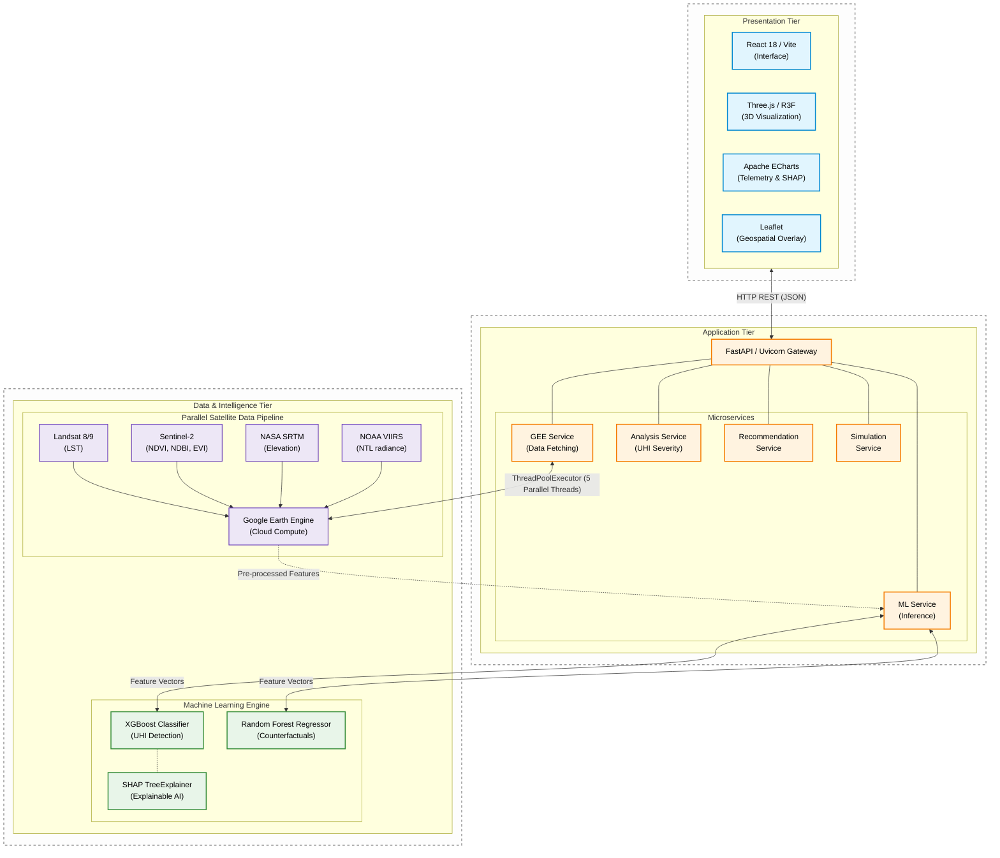

# Fig. 1. Three-Tier UHIS System Architecture

Below is the Three-Tier Architecture Diagram generated from a research perspective, directly incorporating structural details and specific tools mentioned in your research paper.

> [!NOTE]
> This diagram captures the system's separation of concerns (Presentation, Application, and Data/Intelligence) and emphasizes the multi-threaded Parallel Satellite Data Pipeline, which is crucial for highlighting the real-time inference characteristics needed in an academic context.

### Explanation of Components for the Manuscript:
*   **Presentation Tier**: Highlights the frontend stack using React/Three.js for web and 3D visualization, meeting the "mission-control" interaction requirements described in the paper.
*   **Application Tier**: Showcases the core processing logic routed through the asynchronous FastAPI/Uvicorn server, decomposed into highly cohesive microservices for robustness.
*   **Data/Intelligence Tier**: Groups the dual elements critical to the research: the *Parallel Satellite Data Pipeline* (with distinct satellite sources flowing simultaneously into Google Earth Engine execution) and the *Machine Learning Engine* (XGBoost, Random Forest, and SHAP TreeExplainer running in process). 
*   **Data Channels**: Illustrates the HTTP/REST flow out to the presentation tier and specifically annotates the ThreadPoolExecutor implementation between Application and Intelligence tiers that was highlighted as a critical performance optimization in Section III of your paper.
